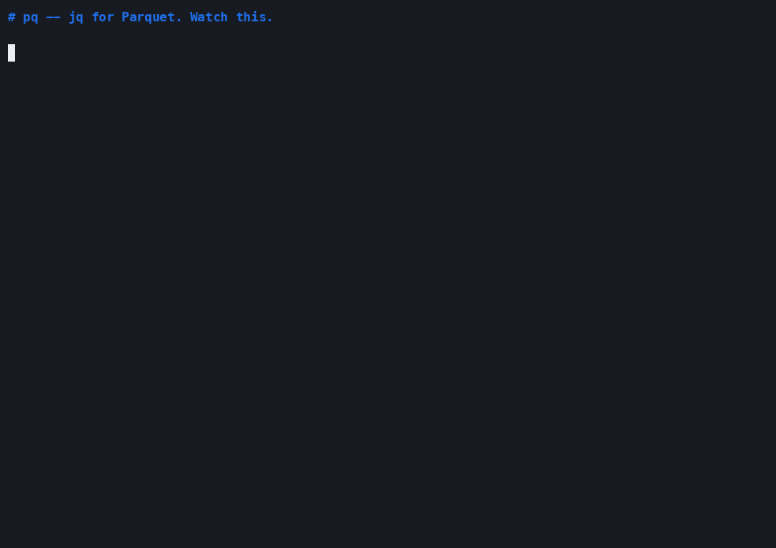

# `pq` — jq for Parquet

[](https://github.com/thehwang/parq/actions/workflows/ci.yml)
[](https://crates.io/crates/pq)
[](LICENSE)

Query parquet files with a concise expression syntax. Single binary, no JVM, no Python.

> **New in v0.10 — first-class nested schema support.** `LIST` / `STRUCT` / `MAP` columns now render as proper JSON (was Rust-Debug strings) and the DSL grew jq-style sugar: `.tags[0]`, `.tags[]`, `.events[0].kind`, `.metadata["plan"]`, `len(.tags)`, `keys(.metadata)`. JSON output now preserves projection order (was alphabetical).
>
> _v0.9.1: `to_ndjson` / `to_jsonl` aliases. v0.9: stdin auto-spool (`cat f.parquet | pq -`) + `-i ndjson` chains. v0.8: async `EXPLAIN ANALYZE`, persisted query history. v0.7: Homebrew tap. v0.6: semantic sync + Explain panel. v0.5: the TUI._
>
> Already on Homebrew? `brew update && brew upgrade pq` to grab v0.10.

```bash
$ pq sales.parquet 'group_by .country | sum .revenue | top 3 by sum_revenue'
┌─────────┬─────────────┐
│ country ┆ sum_revenue │
╞═════════╪═════════════╡
│ US      ┆ 19065.00    │
│ FR      ┆ 999.99      │
│ DE      ┆ 312.00      │
└─────────┴─────────────┘
(3 rows)
```



## Why?

The current options for ad-hoc parquet querying are all painful:

| Tool | Pain |
|---|---|
| `pyarrow` / `pandas` | 5 second cold start, 200MB virtualenv |
| `parquet-tools` (Apache) | JVM, slow, no query support |
| `pqrs` | Inspector only — can't filter or project |
| `duckdb` CLI | Great engine, but `SELECT email FROM 'file.parquet' WHERE country='US'` is too verbose for one-liners |
| Spark | Are you serious |

`pq` is a 50 MB single binary that wraps DuckDB's query engine in a `jq`-style syntax optimized for terminal one-liners and pipes.

## Install

```bash
# One-liner (auto-detects macOS arm64/x86_64 + Linux musl, installs to ~/.local/bin)
curl -fsSL https://raw.githubusercontent.com/thehwang/parq/main/install.sh | bash

# Homebrew
brew install thehwang/parq/pq

# Prebuilt binary, manual (replace asset name for your platform)
curl -fsSL https://github.com/thehwang/parq/releases/latest/download/pq-aarch64-apple-darwin.tar.gz \
  | tar xz && sudo mv pq /usr/local/bin/

# Windows: download .zip from the Releases page
#   https://github.com/thehwang/parq/releases/latest

# From source
cargo install pq

# Build from this repo
git clone https://github.com/thehwang/parq && cd parq
cargo build --release && ./target/release/pq --help
```

Available prebuilt assets per release: `aarch64-apple-darwin`, `x86_64-apple-darwin`,
`x86_64-unknown-linux-musl` (works on every Linux), `x86_64-pc-windows-msvc` (.zip).
Each tarball/zip ships with a `.sha256` sidecar.

## Quickstart

### Single-stage (the v0 way — still supported)

```bash
pq users.parquet                                  # head 20
pq users.parquet '.email'                         # one column
pq users.parquet '.user.id'                       # nested struct path
pq users.parquet '.email, .name, .country'        # multi
pq users.parquet 'country == "US"'                # filter only
pq users.parquet '.email where .country == "US"'  # both
```

### Pipe stages (the killer feature)

Stages are separated by `|`. Output of one stage flows into the next.

```bash
# Top countries by revenue
pq sales.parquet 'group_by .country | sum .revenue | top 10 by sum_revenue'

# Filter, group, having
pq users.parquet 'where .age > 18 | group_by .country | count | where count > 100'

# Distinct values
pq logs.parquet '.user_id | distinct | sort by .user_id'

# Multi-aggregate
pq events.parquet 'group_by .country | count | sum .duration | avg .duration'
```

| Verb | Example | SQL emitted |
|---|---|---|
| `where EXPR` | `where .age > 18` | `WHERE age > 18` (or `HAVING` after group_by) |
| `select .col, .col2` | `select .email, .name` | `SELECT email, name` |
| `group_by .col[, .col2]` | `group_by .country` | `GROUP BY country` |
| `count` / `count_distinct .col` | `count_distinct .npi` | `count(DISTINCT npi) AS count_distinct_npi` |
| `sum/avg/min/max .col` | `sum .revenue` | `sum(revenue) AS sum_revenue` |
| `top N by COL [asc\|desc]` | `top 10 by sum_revenue` | `ORDER BY sum_revenue DESC LIMIT 10` |
| `sort by .col [asc\|desc]` | `sort by .revenue desc` | `ORDER BY revenue DESC` |
| `limit N` / `head N` | `limit 5` | `LIMIT 5` |
| `distinct` | `distinct` | `SELECT DISTINCT` |
| `[inner\|left\|right\|full]_join "f" on …` | `left_join "o.parquet" on .id` | `LEFT OUTER JOIN read_parquet('o.parquet') AS b …` |
| `to_csv` / `to_json` | `.email, .country \| to_csv` | wraps in `concat_ws(',', …)` / `to_json({…})` |

### Subcommands

```bash
pq schema  users.parquet     # column names + types + nullable
pq stats   users.parquet     # min, max, approx_distinct, null_pct per col
pq sample  users.parquet -n 10
pq head    users.parquet -n 5
pq tail    users.parquet -n 5
pq count   users.parquet
pq tui     users.parquet     # interactive 4-panel browser (see below)
```

### Interactive TUI (`pq tui FILE`)

Lazygit-style 4-panel browser for exploring a parquet file without leaving
the terminal:

```
┌─ Columns · 5 ──────────┐ ┌─ Query · 2 ms ──────────────────────────┐
│ ✓ id        BIGINT     │ │ group_by .country | sum .revenue        │
│ ✓ email     VARCHAR    │ │                                         │
│ ✓ country   VARCHAR    │ └─────────────────────────────────────────┘
│ ▶ revenue   DOUBLE     │ ┌─ Data · 7 of 7 rows shown ─────────────┐
│   age       BIGINT     │ │ country │ sum_revenue                  │
│                        │ │ US      │ 19065.00                     │
└────────────────────────┘ │ FR      │   999.99                     │
┌─ Filters · 1 ──────────┐ │ DE      │   312.00                     │
│ • .country == "US"     │ │ ...                                    │
└────────────────────────┘ └────────────────────────────────────────┘
 Tab next │ ␣ toggle col │ ⏎ append │ Q exit+print │ Esc/q quit │ : SQL │ ?
```

The Query panel is the source of truth: edit your DSL there, watch the
Data panel re-run live (50 ms throttle), peek at compiled SQL with `:`,
and exit with `Q` to dump the equivalent `pq` CLI one-liner to stdout
— so the TUI doubles as a query builder for your shell history.

#### v0.6 super-powers

- **Semantic sync.** Park your cursor on `sum_revenue` in the Query panel
  and `★ revenue` lights up gold in the Columns panel. Move the Data
  panel cursor onto a column header — same trick, source field highlights
  back in Columns. Lineage is forgiving: works on partial / mid-typing
  queries too.
- **Schema completion.** Type `.c` in the Query panel and a popup of
  matching columns appears (prefix wins; substring matches still shown).
  `Tab` / `↑↓` to cycle, `Enter` to accept, `Esc` to dismiss.
- **Drill-down.** Run `group_by .country | count`, focus the Data panel,
  arrow down to the `US` row, hit `Enter` — the Query panel grows a
  `where .country == "US"` clause and re-runs. `Backspace` undoes the
  drill if you went too deep.
- **Explain panel (`e`).** Pops a band under Data showing how DuckDB
  plans your query: scans, predicate pushdown, projection pushdown, and
  💡 heuristic hints when something obvious is missing —
  e.g. `💡 add 'where .dt = …' to prune partitions` if your path has
  hive segments but the query doesn't reference them.
- **`EXPLAIN ANALYZE` on demand (`E`, capital).** Same panel, but the
  numbers are real: actual rows, per-op timing, total wall-clock — and
  if the optimizer's estimate diverged from reality by 10×+, you get a
  💡 stale-stats hint. Power-feature only because it executes the full
  query (no LIMIT 50 cap), so don't reflexively press `E` against a
  remote 100 GB table.

Keys at a glance (full list inside the TUI via `?`):

| key | what it does |
|---|---|
| `Tab` / `Shift-Tab` | cycle focus across panels |
| `↑↓` / `j k` | move cursor (Columns / Data row) |
| `← →` | move column cursor in Data panel (drives semantic sync) |
| `Space` | toggle column in projection (Columns panel) |
| `Enter` | append column / drill down on Data row / accept completion |
| `Backspace` | undo last drill-down (Data panel) |
| `:` | toggle compiled-SQL panel |
| `e` | toggle Explain panel (pushdown facts + 💡 hints) |
| `E` | run `EXPLAIN ANALYZE` — actual rows + per-op timing (Esc cancels) |
| `Ctrl-↑` / `Ctrl-↓` | browse persisted query history (Query panel) |
| `?` | open help overlay (any key dismisses) |
| `Q` | quit + print equivalent CLI |
| `Esc` / `q` | quit; one Esc inside Query unfocuses first |
| `Ctrl-C` | force quit through any modal |

### Cloud paths, globs, hive auto-discovery

DuckDB's `read_parquet` handles all of these natively. pq auto-loads the
`httpfs` extension and reads cloud credentials from environment variables —
no need to drop into the DuckDB CLI to `CREATE SECRET`:

| env vars                                              | creates                                |
|-------------------------------------------------------|----------------------------------------|
| `PQ_GCS_BEARER_TOKEN`                                 | GCS OAuth secret — recommended for interactive use |
| `PQ_GCS_HMAC_KEY` + `PQ_GCS_HMAC_SECRET`              | GCS HMAC secret — long-lived, for cron / batch     |
| `AWS_ACCESS_KEY_ID` + `AWS_SECRET_ACCESS_KEY`         | S3 secret (also reads `AWS_SESSION_TOKEN`, `AWS_REGION`, `AWS_ENDPOINT_URL_S3`) |
| _(none of the above for S3)_                          | falls back to `credential_chain` — auto-resolves `AWS_PROFILE`, `~/.aws/credentials`, SSO, EC2 IMDS, ECS task role |

```bash
# GCS — OAuth (interactive, easiest; token refreshes ~hourly via gcloud)
export PQ_GCS_BEARER_TOKEN=$(gcloud auth print-access-token)
pq schema gs://bucket/file.parquet

# GCS — HMAC (long-lived, cron-friendly, no expiry)
export PQ_GCS_HMAC_KEY='GOOG1XXXXXX...'    # from `gcloud storage hmac create`
export PQ_GCS_HMAC_SECRET='...'
pq gs://bucket/file.parquet '.email'

# S3 — explicit env vars
export AWS_ACCESS_KEY_ID=AKIA…
export AWS_SECRET_ACCESS_KEY=…
pq s3://my-bucket/file.parquet | head

# S3 — named profile from ~/.aws/credentials (no env vars needed)
export AWS_PROFILE=cadent-prod
pq schema s3://my-bucket/file.parquet

# S3 — SSO  (works once `aws sso login` cached a token)
aws sso login --profile=cadent-sso
AWS_PROFILE=cadent-sso pq schema s3://my-bucket/file.parquet

# S3 — IAM role on EC2 / ECS  (no creds anywhere — chain pulls from IMDS / task role)
pq s3://my-bucket/file.parquet

# Globs (quote them so the shell doesn't expand first)
pq 'data/dt=2026-*/*.parquet' 'group_by .dt | count'
```

**Auto-refresh trick** — drop in your `~/.zshrc` so every new shell gets a
fresh token without thinking about it:

```bash
pq() {
  if [[ -z "$PQ_GCS_BEARER_TOKEN" ]] && command -v gcloud >/dev/null 2>&1; then
    export PQ_GCS_BEARER_TOKEN=$(gcloud auth print-access-token 2>/dev/null)
  fi
  command pq "$@"
}
```

Set `PQ_DEBUG=1` to see which secret got registered (otherwise pq stays
quiet — credential noise has no place on stdout).

**Hive partitioning auto-detects.** Any path containing a `key=value` segment
turns the partition keys into normal columns you can group/filter on:

```bash
# 'sales/dt=2026-05-20/region=US/part-0.parquet' — pq sees dt + region columns automatically
pq 'sales/dt=*/region=*/*.parquet' 'group_by .dt, .region | count | sum .amount'
```

### Joins

INNER (default), LEFT / RIGHT / FULL OUTER — pick the verb that matches what
you'd write in SQL. Left side is `a`, right side is `b` (referenced as
`.a.col` / `.b.col` in subsequent stages):

```bash
# INNER (shorthand: same column name on both sides)
pq orders.parquet 'join "users.parquet" on .user_id | select .a.amount, .b.email'

# Explicit ON expression — different column names per side
pq users.parquet 'join "orders.parquet" on .a.id == .b.user_id \
                  | group_by .a.country | sum .b.amount | sort by .sum_b_amount desc'

# LEFT OUTER — keep all users, even ones with no orders (b.* is ∅)
pq users.parquet 'left_join "orders.parquet" on .a.id == .b.user_id \
                  | select .a.email, .b.amount, .b.status'

# Multi-key — just compose with `and`
pq users.parquet 'inner_join "events.parquet" \
                    on .a.id == .b.user_id and .a.dt == .b.dt | count'
```

`right_join` and `full_join` (alias `outer_join`) work identically. The right
side supports cloud URIs and hive auto-discovery the same as the left.

### Line output: `to_csv` / `to_json`

Two stages that fold each row into a single TEXT line. No headers, no quoting,
no JSON wrapping — what stdout sees is what `awk` / `jq` / `xsv` consume:

```bash
# Raw CSV per row, no header
pq users.parquet '.email, .country, .revenue | to_csv'
# alice@example.com,US,1245.0
# bob@example.com,CA,89.5
# …

# JSON object per row (stable field names — even after group_by/agg)
pq users.parquet 'group_by .country | sum .revenue | to_json' \
  | jq -r 'select(.sum_revenue > 1000) | .country'

# `to_json` with no projection dumps the whole row as a struct
pq users.parquet 'where .age > 18 | to_json' | jq .
```

Internally these wrap your pipeline in a subquery so `sort by` / `limit`
upstream still work as expected.

### `--udf`: register DuckDB SQL macros

Define helpers once, reuse across stages. Repeatable. The `:=` is rewritten
to DuckDB's `CREATE OR REPLACE MACRO ... AS ...` automatically:

```bash
pq sample.parquet \
  --udf $'is_us(c) := c = \'US\'' \
  --udf 'discount(x) := x * 0.9' \
  '.email, discount(.revenue) AS d where is_us(.country) | sort by .d desc'
```

For one-off needs you can also just call DuckDB's built-ins directly inside
`where` / `select` — `regexp_matches`, `list_contains`, `to_timestamp`, etc.

### Watch mode

Re-runs the query every N seconds with a screen-clear between ticks. Drop it
on a directory that's actively being written to:

```bash
pq -w 5 'data/dt=2026-*/*.parquet' 'group_by .dt | count | sort by .dt desc | limit 5'
```

`Ctrl-C` to stop. The status line on stderr reports the tick count + elapsed
time so you can tell it's alive.

### Pipe-friendly

`pq` auto-detects whether stdout is a TTY:

```bash
pq users.parquet '.email' | jq -r 'select(endswith("@example.org"))'
pq users.parquet | head -3
```

### Output formats

```bash
pq users.parquet -o csv > out.csv
pq users.parquet -o json
pq users.parquet -o ndjson

# Export back to parquet (auto-disables default LIMIT)
pq big.parquet 'where .country == "US"' -o parquet > us.parquet
```

### Escape hatch

When the DSL doesn't cover what you need, drop into raw SQL:

```bash
pq users.parquet 'SELECT country, count(*) FROM FILE GROUP BY country ORDER BY 2 DESC'
# `FILE` is substituted with read_parquet('users.parquet')
```

## Grammar

```
query        := stage ( '|' stage )*
              | raw_sql                          -- starts with SELECT/WITH
              | <empty>                          -- => head LIMIT n

stage        := projection                       -- '.col, .col2'
              | filter_expr                      -- 'country == "US"'
              | projection 'where' filter_expr   -- v0 inline shorthand
              | 'where' filter_expr
              | 'select' projection
              | 'group_by' '.' ident (',' '.' ident)*
              | 'count'
              | ('sum'|'avg'|'min'|'max'|'count_distinct') '.' ident
              | 'top' INT 'by' col [ asc | desc ]
              | 'sort by' col [ asc | desc ]
              | 'limit' INT
              | 'distinct'
              | 'join' '"' path '"' 'on' join_clause   -- v0.3
join_clause  := '.' ident                              -- shorthand: a.col = b.col
              | filter_expr                            -- explicit, must contain '='

filter_expr  := <DuckDB SQL fragment>            -- with sugar:
                  "..."   → '...'  (jq strings → SQL string literals)
                  ==      → =
                  !=      → <>
                  bare .col → col
```

## Nested schema (v0.10) + chained UNNEST (v0.11)

Parquet's everyday nested types (`LIST`, `STRUCT`, `MAP`) are first
class. The renderer emits proper JSON for them, and the DSL gained
jq-style bracket sugar so you don't have to drop into raw SQL:

| pq DSL | DuckDB SQL | Notes |
|---|---|---|
| `.user.name` | `user.name` | STRUCT field — already worked, kept naming |
| `.tags[0]` | `tags[1]` | LIST index — pq accepts jq's 0-indexed, translates to DuckDB's 1-indexed |
| `.tags[-1]` | `tags[-1]` | last element (DuckDB native) |
| `.tags[]` | `UNNEST(tags) AS tags` | row explosion — projection only |
| `.events[0].kind` | `events[1].kind` | LIST&lt;STRUCT&gt; — index then field |
| `.events[].kind` | `_pq_u0.kind` (with hoisted FROM) | **v0.11** — chained UNNEST, see below |
| `.metadata["plan"]` | `element_at(metadata, 'plan')[1]` | MAP value lookup |
| `len(.tags)` | `len(tags)` | length |
| `keys(.metadata)` | `map_keys(metadata)` | MAP keys |
| `values(.metadata)` | `map_values(metadata)` | MAP values |

### Chained UNNEST (v0.11)

`.events[].kind` reads "explode the events array, then take `.kind` of
each row". DuckDB rejects raw `UNNEST(events).kind` in any clause that
also has `GROUP BY` / `WHERE` / `HAVING` / `ORDER BY` — the dreaded
`Binder Error: UNNEST not supported here`. v0.11 fixes that uniformly:
every chained `UNNEST(...)` is hoisted into a derived FROM subquery
and rewritten to a `_pq_u<i>` alias, so the outer SELECT only ever
sees plain columns.

```bash
# group_by + count + sort, with row explosion. Just works in v0.11.
pq events.parquet 'group_by .events[].kind | count | sort by .count desc'
# {"events_kind":"click","count":2}
# {"events_kind":"buy","count":1}

# sum across exploded rows
pq events.parquet 'group_by .events[].kind | sum .events[].amount'
# {"events_kind":"buy","sum_events_amount":9.0}
# {"events_kind":"click","sum_events_amount":2.0}

# WHERE on a chained UNNEST — also lifted, also legal.
pq events.parquet 'where .events[].kind == "click" | .user_id, .events[].amount'

# Repeated references to the same exploded list share one UNNEST,
# so `.events[].kind, .events[].amount` produces N rows (not N²).
pq events.parquet '.events[].kind, .events[].amount'
```

The compiled SQL is visible via `--explain` if you want to confirm
the lifting:

```sql
SELECT _pq_u0.kind AS events_kind, count(*) AS count
FROM (SELECT *, UNNEST(events) AS _pq_u0 FROM read_parquet('events.parquet')) AS _pq_src
GROUP BY _pq_u0.kind
ORDER BY count DESC
```

```bash
# Real example — events.parquet has events: LIST<STRUCT(kind, amount)>
pq events.parquet '.user_id, .events[0].kind, .events[0].amount'
# {"user_id":1,"events_0_kind":"click","events_0_amount":1.0}

# Row-explode a scalar array column
pq events.parquet '.user_id, .events[]'
# {"user_id":1,"events":{"kind":"click","amount":1.0}}
# {"user_id":1,"events":{"kind":"buy","amount":9.0}}

# MAP key access in WHERE
pq users.parquet 'where .metadata["plan"] == "pro"'

# Nested types chain through ndjson cleanly
pq events.parquet '.user_id, .events | to_json' \
  | pq -i ndjson - 'where len(.events) > 0 | count'
```

JSON output preserves projection order (the JSON object keys appear in
the order you wrote in the SELECT list, top-level and nested) — useful
when downstream code makes positional assumptions.

For anything `pq`'s sugar doesn't cover (list comprehensions, complex
MAP filters, list_filter / list_transform with lambdas), the raw SQL
escape hatch is always available:

```bash
pq events.parquet 'SELECT user_id, list_filter(events, e -> e.amount > 5) AS big FROM FILE'
```

## Big-file mode (v0.12 + v0.13)

`pq` treats parquet files large enough to be painful as first-class
inputs — no flags required for the common cases:

```bash
# Streaming output (v0.12). ndjson / csv / raw-line outputs ship rows
# to stdout the moment DuckDB hands them over — returns instantly
# even on a 40 GB file. Pre-v0.12 we collected every row into memory
# before emitting any of them.
pq -o ndjson huge.parquet '.user_id' | head -1

# Metadata-only count for parquet (v0.12). Auto-on when the file is
# ≥ 1 GB (override with `PQ_LITE_THRESHOLD=<bytes>`); force with
# --lite. Skips the data scan and reads num_rows from each file's
# footer — orders of magnitude faster on big files.
pq count huge.parquet              # auto-lite if >= 1 GB
pq count --lite glob/*.parquet     # always lite, even on small files

# Metadata-only column stats (v0.13). Same idea as count --lite,
# now for `stats`: per-column min / max / nulls / row count straight
# from each row-group's footer, no decompression. Trade-off:
# `approx_distinct` and `null_pct` are unavailable in lite mode —
# those need the data.
pq stats --lite huge.parquet       # sub-second on a 30 GB file

# Stderr progress spinner (v0.13). Draws after a 300 ms hold-off
# when stderr is a TTY and the query is still running; clears
# itself on completion. Pipelines and CI logs are unaffected.
pq events.parquet 'group_by .events[].kind | count'
# stderr: ⠋  4.2s elapsed — Ctrl-C to cancel
pq events.parquet '...' --no-progress    # opt out
PQ_NO_PROGRESS=1 pq events.parquet '...' # env equivalent

# Cancel mid-query with Ctrl-C (v0.12, CLI). SIGINT forwards to
# DuckDB's `interrupt_handle.interrupt()`, which unwinds within
# milliseconds instead of hanging on a multi-GB scan. Second Ctrl-C
# exits hard (130) in case interrupt() blocks on a slow network read.
pq events.parquet 'group_by .events[].kind | count' &
sleep 0.5; kill -INT %1            # → "Query interrupted" + clean exit

# TUI preview is fully async (v0.13). Type a query against a 12 GB
# file and the event loop keeps ticking — the Query header shows
# `running 1.2s · Esc/Ctrl-C cancels` while the worker thread runs.
# Esc / Ctrl-C interrupts the in-flight preview before quitting.
pq tui huge.parquet
# (in TUI) edit the query freely; preview returns when ready
# (in TUI) press E for analyze, Ctrl-C to cancel mid-run
```

| Knob | Purpose |
|---|---|
| `--lite` (`pq count` / `pq stats`) | Force parquet metadata-only path |
| `PQ_LITE_THRESHOLD=<bytes>` | Override the 1 GB auto-lite threshold |
| `--no-progress` / `PQ_NO_PROGRESS=1` | Suppress the stderr spinner |
| `PQ_HTTP_TIMEOUT=<ms>` | Override the 15 s HTTPFS request timeout |
| Ctrl-C (CLI) | First press = interrupt query; second press = exit 130 |
| Esc / Ctrl-C (TUI) | Cancel running preview / ANALYZE before quitting |

For files that don't fit on the local disk, point `pq` at `gs://` /
`s3://` / `https://` URLs — DuckDB's httpfs is bundled, and we set up
credentials from `AWS_*` / `PQ_GCS_*` env vars automatically. Lite-mode
auto-detection only fires for local paths (size detection over the
network is a footgun); pass `--lite` explicitly for cloud parquet.

## Shell primitive (v0.9)

`pq` reads stdin as a first-class source so it composes with `cat`, `aws s3 cp`,
`gsutil cp`, `kubectl logs`, and any other command that writes structured data:

```bash
# Parquet over a pipe — pq drains the non-seekable fd to a tempfile
# automatically (DuckDB's footer-trailer reader needs random access).
cat data.parquet | pq - 'group_by .country | count'

# Stream from cloud blob storage without a local file.
aws s3 cp s3://my-bucket/sales.parquet - | pq - 'sum .revenue'

# Chain pq invocations through ndjson — self-describing schema, no
# column-order surprises. -i ndjson tells pq to use read_json.
pq sales.parquet '.country, .revenue | to_json' \
  | pq -i ndjson - 'group_by .country | sum .revenue | top 5 by sum_revenue'

# Or chain through CSV (use -o csv on the producer to keep the header).
pq -o csv sales.parquet '.email, .country' \
  | pq -i csv - '.country | distinct'

# Mix with jq / awk freely — everything pq emits is line-oriented.
# (pq's `to_json` already emits one JSON object per row — that's ndjson.)
pq events.parquet '.user_id, .ts | to_json' \
  | jq -c 'select(.ts > "2026-01-01")' \
  | pq -i ndjson - 'count'
```

| Form | What pq does |
|---|---|
| `pq - < f.parquet` | seekable fd, reads in place (zero-copy) |
| `cat f.parquet \| pq -` | non-seekable fd → spool to `/tmp/pq-stdin-*.parquet` |
| `pq -i ndjson -` | stdin → spool with `.ndjson` suffix → `read_json(format='newline_delimited')` |
| `pq -i csv -` | stdin → spool with `.csv` suffix → `read_csv_auto` |
| `pq -i auto data.ndjson` | sniffs format from extension (default) |

The spool tempfile lives in `$TMPDIR` (RAM-backed on macOS) and is deleted as
soon as `pq` exits — no cleanup needed.

## Comparison

```
                       pq      duckdb-cli   pqrs   pyarrow   parquet-tools
size (single binary)  50 MB    24 MB        5 MB   ~200 MB   N/A (JVM)
cold start            ~50 ms   ~80 ms       ~10 ms ~5 sec    ~5 sec
filter / project      ✓        ✓ (verbose)  ✗      ✓         ✗
group_by / agg        ✓        ✓            ✗      ✓         ✗
gs:// / s3:// paths   ✓        ✓            ~      manual    ✗
nested column access  ✓        ✓            ✗      ✓         ~
schema dump           ✓        ✓            ✓      ✓         ✓
streams large files   ✓        ✓            ✓      partial   ✓
```

## What's done

**v0.13** (current) — Big-file mode part 2
- [x] **TUI preview is now async**. Pre-v0.13 every keystroke against a
      12 GB file froze the entire event loop until DuckDB returned —
      not even Ctrl-C got processed. We now spawn the preview on a
      worker thread that owns its own connection and `InterruptHandle`;
      the Query header shows `running 1.2s · Esc/Ctrl-C cancels` so a
      slow scan looks like progress, not a hang. Esc / Ctrl-C
      interrupts the in-flight job before quitting.
- [x] **CLI stderr spinner**: a faint `⠋ 1.2s elapsed — Ctrl-C to
      cancel` line draws on stderr after a 300 ms hold-off, only when
      stderr is a TTY. Pipelines (`pq … | jq …`) and CI logs see
      nothing. Opt out with `--no-progress` or `PQ_NO_PROGRESS=1`.
- [x] **`pq stats --lite`** reads column min/max/null counts from the
      parquet footer's per-row-group statistics — no decompression,
      no scan. On a 30 GB file: sub-second instead of minutes.
      Auto-on for local parquet ≥ 1 GB, force with `--lite`. Lite
      mode reports `rows` and `nulls` per column but skips the
      data-scan-only `approx_distinct` / `null_pct` so callers know
      they didn't get an exact distinct count.
- [x] **HTTP timeouts**: a stuck `gs://` / `s3://` request now unblocks
      within 15 s of an interrupt instead of the DuckDB default 30 s.
      Override with `PQ_HTTP_TIMEOUT=<ms>`.

**v0.12.1**
- [x] `pq … | head -1` no longer prints `Error: Broken pipe (os error 32)`.
      Rust's runtime ignores SIGPIPE by default, which only matters once we
      started streaming output in v0.12 — pre-streaming, the producer
      finished before `head` closed its end of the pipe, so EPIPE never
      surfaced. We now reset SIGPIPE to `SIG_DFL` in `main()`, matching the
      conventional Unix behaviour of every other CLI tool.

**v0.12** — Big-file mode
- [x] Streaming output for ndjson / csv / raw-lines — rows go straight from
      DuckDB's row cursor to stdout without ever filling a `Vec`. Memory
      stays flat regardless of result-set size; `head -1` returns instantly.
- [x] CLI Ctrl-C → `Connection::interrupt_handle().interrupt()`. A multi-GB
      parquet scan unwinds within milliseconds with a clean error instead
      of a half-stream + dirty exit. Second Ctrl-C falls through to a hard
      exit 130 in case interrupt() blocks on a slow remote read.
- [x] TUI Ctrl-C cancels an in-flight EXPLAIN ANALYZE before it touches
      `should_quit`. Worker thread receives interrupt(), badge clears,
      Explain panel falls back to its previous state. A second Ctrl-C
      with no job running quits as before.
- [x] `pq count --lite` (and auto-on for local parquet ≥ 1 GB) reads row
      counts from `parquet_file_metadata(...)` instead of scanning. Glob
      paths sum across files. Override the threshold via
      `PQ_LITE_THRESHOLD=<bytes>`.

**v0.11.1**
- [x] Custom single-line table preset — clean `│ ─ ┌ ┐` charset (DuckDB-CLI style),
      replaces `UTF8_FULL_CONDENSED`'s exotic `┆ ╞ ═ ╪ ╡` glyphs that some macOS
      fonts mis-rendered and made tables look diagonally staggered
- [x] TUI installs a panic hook + best-effort `teardown_terminal` — a panic in
      the event loop no longer leaves your shell in raw mode after `pq tui`
      exits (the symptom was every subsequent multi-line command rendering
      stair-stepped until you ran `stty sane`)
- [x] Cargo.toml version finally tracks the git tag — `pq --version` shows the
      real release number, no more lag

**v0.11**
- [x] Custom single-line table preset — clean `│ ─ ┌ ┐` charset (DuckDB-CLI style),
      replaces `UTF8_FULL_CONDENSED`'s exotic `┆ ╞ ═ ╪ ╡` glyphs that some macOS
      fonts mis-rendered and made tables look diagonally staggered
- [x] TUI installs a panic hook + best-effort `teardown_terminal` — a panic in
      the event loop no longer leaves your shell in raw mode after `pq tui`
      exits (the symptom was every subsequent multi-line command rendering
      stair-stepped until you ran `stty sane`)
- [x] Cargo.toml version finally tracks the git tag — `pq --version` shows the
      real release number, no more lag

**v0.11**
- [x] Chained UNNEST sugar: `.events[].kind` works in `select / where / group_by /
      having / order_by` — full LIST<STRUCT> path navigation in any clause
- [x] `count_distinct(.x)`, multi-arg aggregates, and `top N by` interplay with
      chained-UNNEST aliases

**v0.10**
- [x] Nested schema as a first-class citizen — `value_to_json` recurses into
      LIST / STRUCT / MAP, so JSON / NDJSON output round-trips cleanly
- [x] Path tokens accept `[N]` (jq 0-indexed → DuckDB 1-indexed), `[]`, `["key"]`,
      `len(.foo)`, `.foo | length`, `keys(.foo)`
- [x] Function-style projections (`keys(.metadata)`) parse as projections, not
      WHERE filters
- [x] Per-subcommand `-i/--input`, `-n`, `--udf` flags — `pq tui -i ndjson FILE`
      now parses correctly (was a clap `args_conflicts_with_subcommands` quirk)
- [x] Timestamps render as ISO-8601 strings, not `timestamp(<micros>)` debug

**v0.5.1**
- [x] S3 `credential_chain` fallback — `AWS_PROFILE`, `~/.aws/credentials`, SSO,
      EC2 IMDS, and ECS task role now Just Work without setting `AWS_ACCESS_KEY_ID`

**v0.5**
- [x] `pq tui FILE` — interactive 4-panel browser (Columns / Filters / editable Query / live Data)
- [x] Editable DSL panel as the source of truth, throttled live preview (50 ms)
- [x] Ghost-text placeholder, visible block cursor when focused, `Esc/q` quits
- [x] `Space` toggles a column, `Enter` appends, `?` opens full help overlay
- [x] Compiled SQL hidden behind `:` (DSL-first, SQL on demand)
- [x] Auto-loads `httpfs` + creates DuckDB secrets from env vars: `PQ_GCS_BEARER_TOKEN`, `PQ_GCS_HMAC_*`, `AWS_*` — no more `duckdb -c CREATE SECRET` dance
- [x] Numeric columns right-align with cyan headers; long values get `…` truncation marker

**v0.4**
- [x] LEFT / RIGHT / FULL OUTER joins (alongside INNER)
- [x] Multi-key joins: `'join "b" on .a.x == .b.x and .a.y == .b.y'`
- [x] `to_csv` / `to_json` line-output stages — raw line per row, no headers
- [x] `--udf` flag — register DuckDB SQL macros before the query runs
- [x] Windows binary (`x86_64-pc-windows-msvc.zip`) on every release
- [x] Homebrew tap: `brew install thehwang/parq/pq`
- [x] One-line installer: `curl -fsSL …/install.sh | bash`

**v0.3**
- [x] Hive partitioning auto-detects from `key=value` path segments — no flag needed
- [x] Single equi-join: `'join "b.parquet" on .col'` and `'join "b.parquet" on .a.x == .b.y'`
- [x] Watch mode: `pq -w 5 file.parquet 'count'` re-runs every N seconds
- [x] Date32 columns display as `YYYY-MM-DD`
- [x] Prebuilt binaries on every tag — macOS arm64/x86_64 + Linux musl

**v0.2**
- [x] Glob expansion: `pq 'data/dt=2026-*/*.parquet' 'count'`
- [x] Aggregation sugar: `group_by`, `count`, `sum/avg/min/max`, `count_distinct`
- [x] Sorting sugar: `top N by .col`, `sort by .col [desc]`
- [x] Output to parquet: `pq a.parquet 'where .country == "US"' -o parquet > us.parquet`
- [x] Pipe stages with WHERE/HAVING auto-routing

## What's coming

**v0.14 — Big-file polish**
- [ ] Streaming JSON output (today JSON still buffers because of the
      wrapping `[]`; a hand-written incremental array writer fixes it).
- [ ] Explain panel surfaces row-group pruning from DuckDB's JSON profile
      (`operator_rows_scanned` / `operator_cardinality`) — "filter cut
      80 % of file before decompression"-style hints.
- [ ] Schema diff: `pq diff a.parquet b.parquet` — column-level adds /
      drops / type changes between two parquet files.

**Beyond v0.14**
- [ ] Multi-file tabs in TUI with visual join builder
- [ ] Query history with branching (every keystroke a frame, rewindable)
- [ ] Conditional DSL (`if .x > 0 then 1 else 0 end`), regex sugar, date math
- [ ] "Did you mean .country?" typo suggestions on column-not-found errors
- [ ] DuckDB GCS `credential_chain` ADC support once duckdb#22413 lands

## Limitations (v0)

- The "where" keyword in projection split is naive — quoted strings containing
  the literal text " where " inside them break parsing. Workaround: use
  the SQL passthrough.
- DuckDB embed adds ~30 MB to the binary. We accept the tradeoff for correctness.
- `-` (stdin) reads from `/dev/stdin` only; OS fifos / named pipes work but raw
  pipes from `cat` won't (DuckDB needs a seekable file).

## License

MIT
